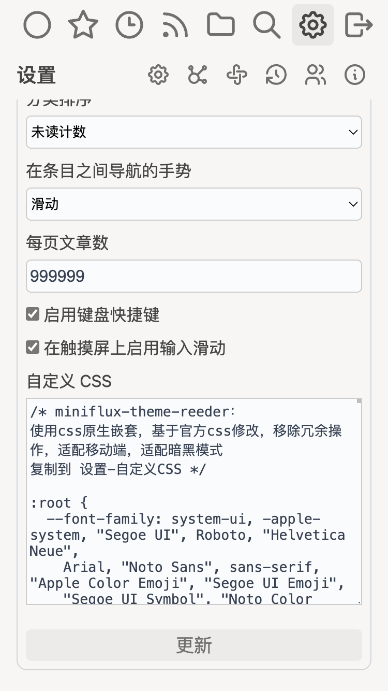
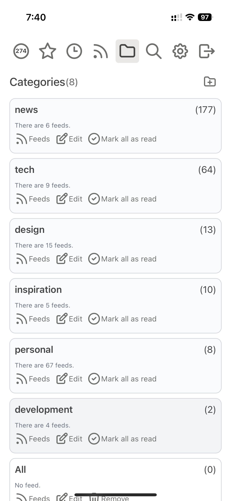
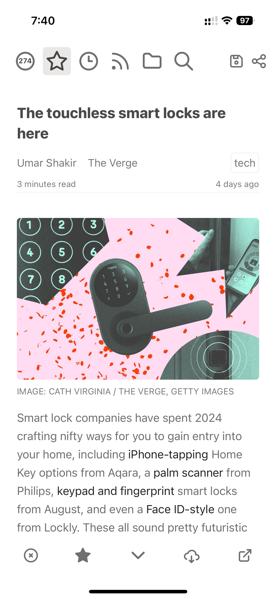
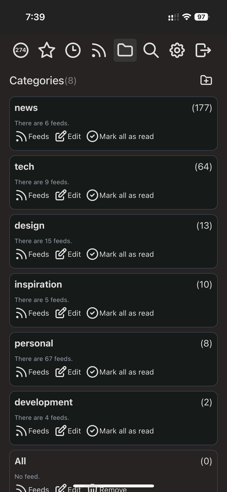
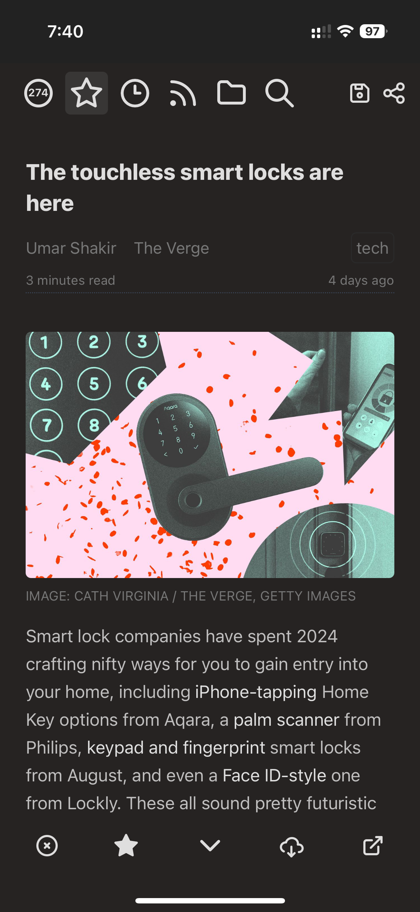
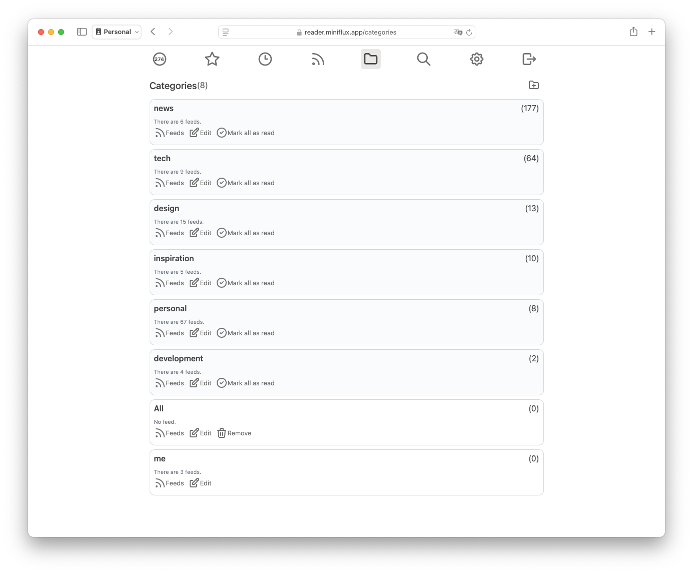
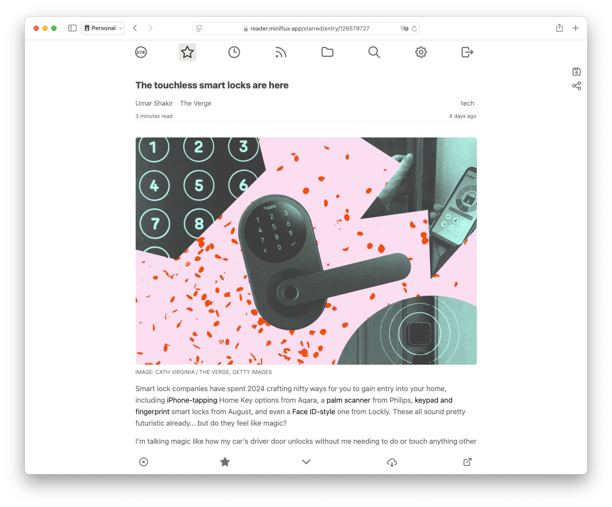

# miniflux-theme-reeder

This is just a translation of the [excellent theme from rootknight](https://github.com/rootknight/Miniflux-Theme-Reeder) with some optimizations for e-ink displays.

[Miniflux v2](https://github.com/miniflux/v2) Custom Theme for Miniflux v2

- Uses native CSS nesting
- Supports custom configuration
- Based on official CSS modifications
- Removes redundant operations
- Adapts to mobile devices
- Supports dark mode
- Compatible with Miniflux version: 2.1.1

# Usage

Copy [style.min.css](https://github.com/rootknight/Miniflux-Theme-Reeder/blob/main/style.mini.css) to Settings - Custom CSS

一Some Suggestions

- You can view the top of style.css for custom configuration
- Choose the theme System - Sans Serif to follow the system's light/dark mode
- Set the number of articles per page to 999999 to hide the pagination buttons
- Use PWA mode on mobile (install to home screen)
  - Set PWA display mode to standalone
  - For Android, use Chrome/Edge to add to the phone
  - For iPhone, use Safari to add to the home screen

# Screenshots

    
    
    
    

    
    

